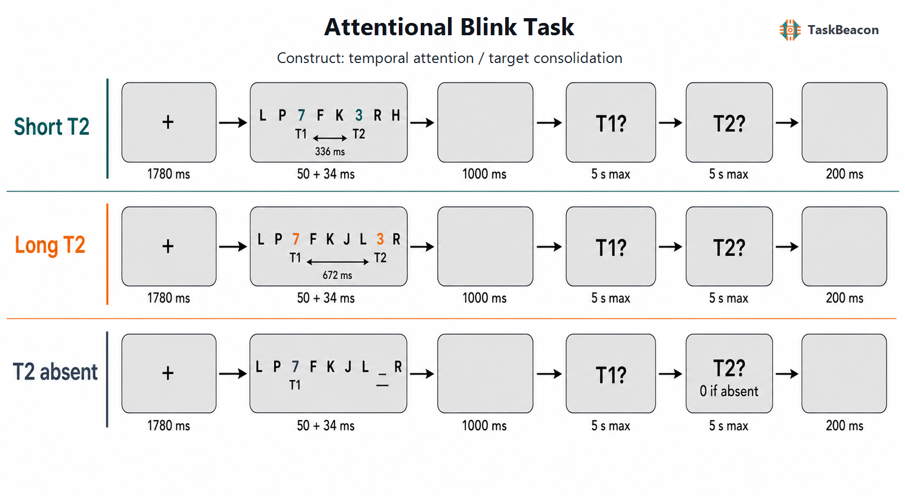

# 注意瞬脱范式：时间选择性注意、意识通达与目标巩固的实验研究

视觉系统能够并行提取大量感觉信息，但连续目标能否在数百毫秒内形成可报告表征仍受时间选择性注意的限制。注意瞬脱（attentional blink, AB）范式以快速序列视觉呈现（rapid serial visual presentation, RSVP）将两个目标嵌入干扰项流，并操纵第一目标（T1）与第二目标（T2）的时间间隔；当 T2 在 T1 后约 200–500 ms 出现时，T2 报告率通常下降，而 T1 报告保持相对稳定（Raymond et al., 1992; Dux & Marois, 2009）。该现象为区分早期知觉分析、目标选择、工作记忆巩固和意识通达提供了可控的时间窗口。AB 效应稳定存在于群体均值，但其形态会随目标定义、干扰项、报告规则与个体策略改变，因此它更适合作为特定任务条件下时间加工限制的操作指标，而非单一、过程纯净的“注意容量”读数。

## 1. 范式提出与理论背景

Raymond 等人（1992）在 RSVP 中要求先识别白色 T1，再检测稍后出现的黑色字母 X；只有需要辨认 T1 时，短间隔 T2 检测才显著受损，由此提出“attentional blink”一词。经典现象还包括滞后 1 保留（lag-1 sparing）：T2 紧随 T1 时有时免于受损，但插入一个干扰项后正确率下降。该结果说明 AB 并非简单的感觉不应期，目标之间是否形成同一时间事件、T1 后干扰项是否触发抑制以及报告任务是否切换，都会改变效应（Martens & Wyble, 2010）。

两阶段模型将加工分为快速、容量较大的初级表征阶段与容量有限的工作记忆巩固阶段。T1 占用第二阶段时，T2 的易损表征容易衰退或被后续项目替代（Chun & Potter, 1995）。门控类解释则强调 T1 引发短暂增强，其后的干扰项继而触发抑制，使工作记忆入口暂时关闭（Olivers & Meeter, 2008）。这些解释共享一个关键判断：短滞后 T2 并非必然没有得到任何加工，主要限制发生在稳定编码和可报告表征形成之前或期间。近期基于视觉注意理论的参数分解发现，AB 主要表现为 T2 加工容量降低，支持编码瓶颈，未支持单纯维持失败或过滤器关闭的解释（Petersen & Vangkilde, 2022）。然而，目标整合、干扰抑制、任务切换和决策标准均可能参与，单一长滞后基线不足以完全辨认这些成分。

## 2. 任务逻辑、流程与核心参数

典型双目标 RSVP 试次先呈现注视点，随后以约 60–120 ms 的刺激起始异步（stimulus onset asynchrony, SOA）在同一位置连续呈现字母、数字、图形或面孔。T1 在序列中段出现，T2 位于 T1 后若干位置；实验至少设置一个预期出现 AB 的短滞后和一个恢复后的长滞后，并随机交错。序列结束后分别报告两个目标。T2 的核心因变量是以 T1 正确为条件的准确率，即 T2|T1；短、长滞后 T2|T1 之差可表征 AB 幅度，多个滞后点则可估计效应起始、谷值与恢复曲线（Dux & Marois, 2009）。同时报告无条件 T2 准确率、T1 准确率、顺序交换和遗漏错误，有助于识别总体难度、时间绑定与目标巩固差异。

序列结束后的报告反应时主要包含提取、决策和按键过程，不能直接标定 T2 在 RSVP 中被选择的时刻。若研究问题关注在线加工时间，应结合以 T2 起始锁时的 EEG、眼动或探测反应；若采用延迟自由报告，则应优先解释准确率与错误类型，并把反应时作为辅助指标。

T2|T1 的条件化排除了明显未完成 T1 选择的试次，但也会改变不同组别的有效试次数与样本构成；当 T1 准确率存在组间差异时，条件化结果仍不能视为纯粹 T2 加工。T2 缺失试次可估计虚报和反应偏向，单目标试次可分离双目标代价。滞后 1、短滞后和长滞后各自对应时间整合、瞬脱谷值和恢复基线，不能相互替代。刺激类别一致性、T1 与 T2 是否需要任务切换、T1 后第一个干扰项的相似性以及序列末端掩蔽都会改变 AB 曲线，跨研究比较应优先使用完整的滞后函数，而非仅比较一个差值（Martens & Wyble, 2010）。

AB 范式没有统一的反馈或自适应程序。练习阶段通常提供正确性反馈以稳定目标映射，正式阶段则避免逐试次反馈改变策略；部分研究在正式实验前调整刺激时长、对比度或掩蔽强度，使 T1 与长滞后 T2 脱离地板和天花板。若按个体表现在线改变 SOA 或目标显著性，所得阈值反映的是达到预定正确率所需的呈现条件，不再与固定滞后下的 AB 幅度同义。设计上应使短、长滞后的目标后掩蔽、目标概率与报告要求尽可能一致，并将滞后与 T2 是否出现交叉操纵。统计分析宜在试次水平估计“滞后 × T2 出现”的效应，同时把 T1 正确、区组和练习进程纳入模型，以免总体准确率差异被误读为时间选择性注意的特异变化。

## 3. 主要行为与神经科学发现

### 3.1 目标巩固、时间绑定与意识报告

行为证据较一致地表明，AB 反映多个相互作用的限制。短滞后下降支持 T1 加工与 T2 稳定编码之间的竞争；滞后 1 保留及顺序交换则提示相邻目标可能被整合进同一时间事件。连续报告研究进一步显示，被“瞬脱”的 T2 并非总是全有或全无：注意范围较宽时，报告可偏向目标真实特征但精度降低；注意范围较窄时则更接近离散遗漏（Karabay et al., 2022）。对方向特征的研究还发现，瞬脱条件下当前反应更易受同试次及前一试次刺激牵引，说明 AB 指标同时受到时间整合与序列依赖影响（Yildirim et al., 2024）。因此，二元正确率适于描述可报告性，却不足以单独判定意识表征的质性状态。

训练效应也不支持固定容量的简单解释。密集冥想训练后，部分参与者的 AB 减小，并伴随 T1 诱发脑反应的资源分配变化（Slagter et al., 2007）。计算模型可以通过任务无关活动与目标加工竞争的改变同时拟合行为和事件相关电位，但模型参数仍是对潜在过程的解释性表征，并非直接测得的神经资源（Amir et al., 2022）。这些结果支持注意分配策略具有可塑性，同时不构成特定训练方案普遍改善日常注意的证据。

### 3.2 EEG 与 fMRI 所揭示的加工阶段

事件相关电位（event-related potential, ERP）证据将 AB 的主要限制定位于早期感觉辨别之后。短滞后未报告的 T2 仍可诱发与知觉和语义分析相关的早期成分，而与工作记忆更新和可报告通达相关的 P3 明显减弱或缺失（Vogel et al., 1998）。高时间分辨率研究进一步表明，未报告 T2 可保留早期诱发活动，但约 270 ms 之后的广泛活动分化更能区分可见与不可见试次（Sergent et al., 2005）。采用分级可见性评分的近期 ERP 研究在 N1、N2 和 P3 上观察到随主观可见性变化的梯度，提示“晚期活动缺失”等同于全无意识的结论依赖报告尺度和任务设计（Eiserbeck et al., 2022）。头皮 ERP 可以约束时间进程，但不能单独提供精确的脑源定位。

功能磁共振成像（functional magnetic resonance imaging, fMRI）研究显示，短滞后下已报告与遗漏 T2 在视觉皮层仍有反应，而可报告 T2 更稳定地伴随额顶叶和颞叶相关活动；这支持感觉表征与后期选择/巩固的分离（Marois et al., 2004）。fMRI 的条件差异说明分布式网络参与，并不能证明某一区域是 AB 的唯一原因。近期连接组预测研究从健康成人的静息态连接构建 AB 网络，其连接强度能够交叉验证预测 AB 幅度，并在独立儿童样本中与 ADHD 症状评分相关（Zhang et al., 2023）。由于任务行为与症状并非来自同一儿童样本，且预测依赖样本筛选和分析管线，该结果尚不能支持临床诊断或因果机制解释。

## 4. 范式发展与主要应用

AB 已从字母—数字检测扩展至面孔、情绪刺激、跨模态线索、连续特征报告和动物比较。2023 年的人—猕猴平行研究观察到相似的时间盲区，为跨物种研究意识通达提供了方法基础，但物种间任务训练和报告方式不同，不能据此假定完全同源的心理过程（Chinen et al., 2023）。在线方法学研究使用视觉物体在浏览器中复现了 Lag 2–3 的下降和滞后 1 保留，表明远程采集可检出群体 AB 效应；设备刷新率和呈现时序的个体差异仍限制精细时间参数与个体诊断用途（Sharabas et al., 2023）。

发展与临床研究利用 AB 曲线描述时间注意的年龄和群体差异。儿童至成人的比较显示，年龄变化可同时涉及瞬脱深度、恢复速度、顺序交换和绑定错误，不能将更大的 AB 直接解释为总体发展落后（Russo et al., 2018）。ADHD 儿童研究报告了滞后曲线和性别分层差异，但部分效应与 T1 基线、任务参数及样本构成相伴；2025 年一项较大样本研究发现男、女儿童的起始与恢复模式不同，作者亦要求纵向和神经影像验证（Shi et al., 2025）。因此，AB 可用于检验临床群体的时间选择假设，却不宜作为独立筛查或分型工具。

## 5. 测量效度与解释边界

AB 的群体效应具有较强可重复性，个体差异的信度则取决于任务版本和指标。两种 AB 任务在同一版本内可呈现中等至良好的内部一致性和短期重测稳定性，但跨版本相关较弱，提示不同目标类别或任务切换要求测得的限制并不等价（Dale & Arnell, 2013）。差值指标还会叠加短、长滞后各自的测量误差，并受到天花板、地板和练习效应影响。研究个体差异时，应预注册有效试次阈值，报告各条件 T1 与 T2|T1 的置信区间，并优先采用层级二项模型或完整滞后曲线。

构念效度需要由操作对照建立。短滞后低于长滞后支持时间相邻目标之间的加工限制，但不自动区分容量瓶颈、门控抑制、时间整合或报告决策。T2 缺失条件有助于估计偏向，却因其物理序列与 T2 呈现条件不同而不是等价基线。神经指标也应绑定到具体阶段：早期 ERP 保留支持初级加工，P3 或晚期额顶活动差异支持可报告巩固相关过程；二者都不足以单独证明意识的充分条件。群体差异、脑—行为相关及训练前后变化均需与感觉能力、动机、疲劳、药物、反应策略和多重比较等替代解释共同评估。

## 6. TaskBeacon 中的任务实现

### 6.1 任务资源与访问入口

| 资源 | ID | 用途 | 地址 |
|---|---|---|---|
| 完整行为实验源码 | T000058 | PsychoPy/PsyFlow 中文行为采集实现 | [GitHub](https://github.com/TaskBeacon/T000058-attentional-blink) |
| 浏览器伴随版源码 | H000058 | 与 T 版条件、时序和计分对齐的网页实现；不含串口触发与采集硬件 | [GitHub](https://github.com/TaskBeacon/H000058-attentional-blink) |
| 公开运行入口 | H000058 | 浏览器行为体验与数据采集入口 | [TaskBeacon Web Runner](https://taskbeacon.github.io/psyflow-web/?task=H000058-attentional-blink) |

T000058 是行为采集版本，H000058 保留相同的 34 个练习试次、4 × 102 个正式试次与主要输出字段。浏览器版使用像素布局且不发送串口触发；尽管其流程并未缩短，显示刷新、浏览器调度和键盘环境仍不同于受控实验室运行，因此两者的毫秒级时序不应直接视为等价。

### 6.2 实现流程与关键参数

**图 1. TaskBeacon T000058 的试次流程与条件。** 每个试次依次包含 1,780 ms 注视、RSVP 序列、1,000 ms 序列后空屏、最长 5 s 的 T1 报告、最长 5 s 的 T2 报告及 200 ms 试次间隔。每个 RSVP 项呈现 50 ms，随后空屏 34 ms，SOA 为 84 ms；目标为互不相同的数字 2–9，干扰项为排除 B、I、O、Q、S 的大写字母。短、长条件分别在 Lag 4（T1–T2 起始间隔 336 ms）和 Lag 8（672 ms）呈现 T2；缺失条件在相应 T2 位置呈现空白。参与者按出现顺序报告 T1 与 T2，确认 T2 缺失时第二次按 0。练习试次依据两个回答给出 800 ms 正误反馈，正式试次不提供逐试次反馈。T2 正确率仅在 T1 正确试次中计入；AB 幅度定义为长间隔 T2 呈现条件的 T2|T1 减去短间隔 T2 呈现条件的 T2|T1。任务不采用自适应控制，条件数量、目标位置与刺激流在区组开始前按固定随机种子生成。

TaskBeacon 当前版本每个正式区组包含短间隔 T2 呈现 48 次、长间隔 T2 呈现 18 次、短间隔 T2 缺失 18 次及长间隔 T2 缺失 18 次，共 102 次；4 个区组合计 408 次。短、长序列分别含 15 和 19 个位置，T2 后随机保留 2–4 个序列位置，以匹配目标后的掩蔽。符合条件的非目标位置以 20% 概率置空，但 T1/T2 相邻位置与末位受到保护。主要输出包括 T1、T2 反应和反应时、超时、分目标正确性、T2|T1、条件与滞后。该实现源自 Slagter 等人（2007）的数字目标版本，但增加了显式 T2 缺失判断并固定比较 336 与 672 ms；所得差值适合检验预定短—长间隔效应，不提供完整 AB 时间曲线或滞后 1 保留估计。

## 参考文献

Amir, N., Tishby, N., & Nelken, I. (2022). A simple model of the attentional blink and its modulation by mental training. *PLOS Computational Biology, 18*(8), e1010398. https://doi.org/10.1371/journal.pcbi.1010398

Chinen, K., Kawabata, A., Tanaka, H., & Komura, Y. (2023). Inaccessible time to visual awareness during attentional blinks in macaques and humans. *iScience, 26*(11), 108208. https://doi.org/10.1016/j.isci.2023.108208

Chun, M. M., & Potter, M. C. (1995). A two-stage model for multiple target detection in rapid serial visual presentation. *Journal of Experimental Psychology: Human Perception and Performance, 21*(1), 109–127. https://doi.org/10.1037/0096-1523.21.1.109

Dale, G., & Arnell, K. M. (2013). How reliable is the attentional blink? Examining the relationships within and between attentional blink tasks over time. *Psychological Research, 77*(2), 99–105. https://doi.org/10.1007/s00426-011-0403-y

Dux, P. E., & Marois, R. (2009). The attentional blink: A review of data and theory. *Attention, Perception, & Psychophysics, 71*(8), 1683–1700. https://doi.org/10.3758/APP.71.8.1683

Eiserbeck, A., Enge, A., Rabovsky, M., & Abdel Rahman, R. (2022). Electrophysiological chronometry of graded consciousness during the attentional blink. *Cerebral Cortex, 32*(6), 1244–1259. https://doi.org/10.1093/cercor/bhab289

Karabay, A., Wilhelm, S. A., de Jong, J., Wang, J., Martens, S., & Akyürek, E. G. (2022). Two faces of perceptual awareness during the attentional blink: Gradual and discrete. *Journal of Experimental Psychology: General, 151*(7), 1520–1541. https://doi.org/10.1037/xge0001156

Marois, R., Yi, D.-J., & Chun, M. M. (2004). The neural fate of consciously perceived and missed events in the attentional blink. *Neuron, 41*(3), 465–472. https://doi.org/10.1016/S0896-6273(04)00012-1

Martens, S., & Wyble, B. (2010). The attentional blink: Past, present, and future of a blind spot in perceptual awareness. *Neuroscience & Biobehavioral Reviews, 34*(6), 947–957. https://doi.org/10.1016/j.neubiorev.2009.12.005

Olivers, C. N. L., & Meeter, M. (2008). A boost and bounce theory of temporal attention. *Psychological Review, 115*(4), 836–863. https://doi.org/10.1037/a0013395

Petersen, A., & Vangkilde, S. (2022). Decomposing the attentional blink. *Journal of Experimental Psychology: Human Perception and Performance, 48*(8), 812–823. https://doi.org/10.1037/xhp0001018

Raymond, J. E., Shapiro, K. L., & Arnell, K. M. (1992). Temporary suppression of visual processing in an RSVP task: An attentional blink? *Journal of Experimental Psychology: Human Perception and Performance, 18*(3), 849–860. https://doi.org/10.1037/0096-1523.18.3.849

Russo, N., Kates, W. R., Shea, N., LeBlanc, M., & Wyble, B. (2018). Adults blink more deeply: A comparative study of the attentional blink across different age groups. *Developmental Science, 21*(2), e12512. https://doi.org/10.1111/desc.12512

Sergent, C., Baillet, S., & Dehaene, S. (2005). Timing of the brain events underlying access to consciousness during the attentional blink. *Nature Neuroscience, 8*(10), 1391–1400. https://doi.org/10.1038/nn1549

Sharabas, D., Varlet, M., & Grootswagers, T. (2023). An online browser-based attentional blink replication using visual objects. *PLOS ONE, 18*(8), e0289623. https://doi.org/10.1371/journal.pone.0289623

Shi, J., Tao, Y., Zhao, J., Xu, W., Zhao, Y., Shen, S., & Sun, J. (2025). Gender differences in attentional blink in children with attention deficit hyperactivity disorder. *Scientific Reports, 15*(1), 45222. https://doi.org/10.1038/s41598-025-28910-w

Slagter, H. A., Lutz, A., Greischar, L. L., Francis, A. D., Nieuwenhuis, S., Davis, J. M., & Davidson, R. J. (2007). Mental training affects distribution of limited brain resources. *PLOS Biology, 5*(6), e138. https://doi.org/10.1371/journal.pbio.0050138

Vogel, E. K., Luck, S. J., & Shapiro, K. L. (1998). Electrophysiological evidence for a postperceptual locus of suppression during the attentional blink. *Journal of Experimental Psychology: Human Perception and Performance, 24*(6), 1656–1674. https://doi.org/10.1037/0096-1523.24.6.1656

Yildirim, B., Semizer, Y., & Boduroglu, A. (2024). Temporal integration of target features across and within trials in the attentional blink. *Attention, Perception, & Psychophysics, 86*(3), 731–749. https://doi.org/10.3758/s13414-024-02859-w

Zhang, D., Zhang, R., Zhou, L., Zhou, K., & Chang, C. (2023). The brain network underlying attentional blink predicts symptoms of attention deficit hyperactivity disorder in children. *Cerebral Cortex, 33*(6), 2761–2773. https://doi.org/10.1093/cercor/bhac240
